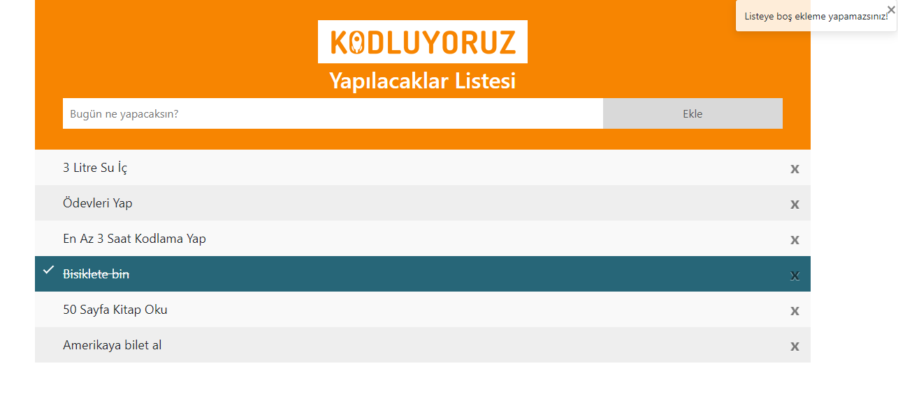

## Javascript dersleri Odev-2

Javascriptin ikinci ödevinde To-Do list yaptık. Listeye ekleme, listeden kaldırma ve yapılan işlerin üstünü çizebilmek gibi özellikler kullanıldı. Ayrıca Bootstrap'te hazır bulunan [.toast](https://getbootstrap.com/docs/4.3/components/toasts/) bildirimi projeye entegre edildi. 
---

 